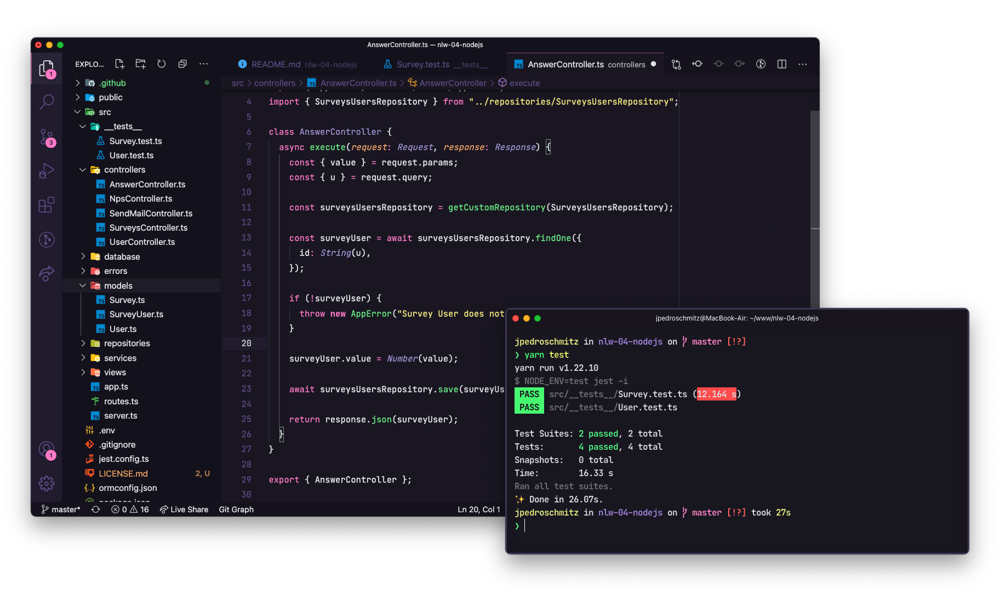

<h1 align="center">API-NPS</h1>

  <a href="#-technology">Technology</a>&nbsp;&nbsp;&nbsp;|&nbsp;&nbsp;&nbsp;
  <a href="#-project">Project</a>&nbsp;&nbsp;&nbsp;|&nbsp;&nbsp;&nbsp;
  <a href="#-diagram">Diagram</a>&nbsp;&nbsp;&nbsp;|&nbsp;&nbsp;&nbsp;
  <a href="#-how-to-run">How to run</a>&nbsp;&nbsp;&nbsp;|&nbsp;&nbsp;&nbsp;
  <a href="#-license">License</a>

  

 

 

  

## ✨ Technology

This project was developed with the following technologies:

- [TypeScript](https://www.typescriptlang.org/)
- [Ethereal-Email](https://ethereal.email/)
- [TypeORM](https://typeorm.io/#/)
- [Express](https://expressjs.com/pt-br/)
- [Jest](https://jestjs.io/)
- [SQL Editor Beekeeper Studio](https://www.beekeeperstudio.io/)

## 💻 Project

API-NPS is an application that consists of calculating the company's NPS. In it we make the registration of users, registration of surveys, sending e-mail for users to answer the satisfaction surveys and with this we can perform the calculation of the NPS.

This project was developed during the NodeJS trail, in the fourth edition of NLW. We learned concepts about what an API is, how to start a project using Typescript and Express for route management, TypeORM for data manipulation, automated tests and sending e-mail.

## 🔶 Diagram

## 🚀 How to run

- Clone the repository
- Install dependencies with `yarn`
- Start the server with `yarn dev`

The application can be accessed at [`localhost:3333`](http://localhost:3333).

## 📄 License

This project is under the MIT license. See the [LICENSE](LICENSE.md) file for more details.

---

Made with ♥ by Rocketseat 👋🏻 [Join our community!](https://discordapp.com/invite/gCRAFhc)